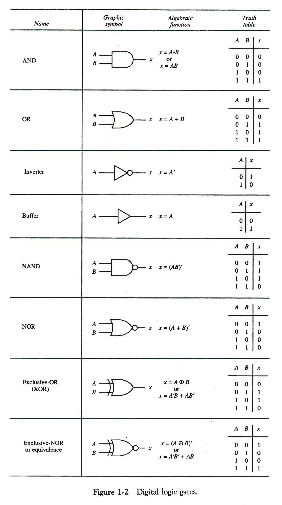
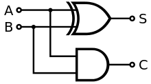
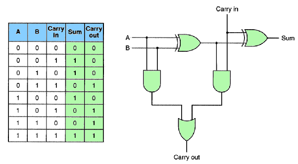

## 디지털 논리회로

### 논리회로 기본 정리


### NAND 게이트

- AND에 버블이 붙은 것이다. AND와 완전히 반대로 작동
- 버블은 o 표시로 현재로직의 부정을 말하며, 이를 invertor 라고 말함.

> js 구현
```js
function nand(paramA, paramB) {
  return !(paramA && paramB);
}
```

### NOR 게이트

OR에 INVERTER(bubble)가 붙어 OR와 완전히 반대로 작동
> js 구현
```js
function nor(paramA, paramB) {
  return !(paramA || paramB);
}
```

## 가산기

쉽게말해 덧셈기다.

### 반가산기(half-adder)

- 쉽게 생각하면 맨 아래 자리의 계산기다.
- 비트 두개를 입력받아 sum과 carry를 출력한다.

#### 합

|  A  |  B  | 출력 |
| :-: | :-: | :--: |
|  1  |  1  |  0   |
|  1  |  0  |  1   |
|  0  |  1  |  1   |
|  0  |  0  |  0   |

#### 자리올림(carry)

|  A  |  B  | 출력 |
| :-: | :-: | :--: |
|  1  |  1  |  1   |
|  1  |  0  |  0   |
|  0  |  1  |  0   |
|  0  |  0  |  0   |

#### 출력을 더해보면

|  A  |  B  | 출력 |
| :-: | :-: | :--: |
|  1  |  1  |  10  |
|  1  |  0  |  01  |
|  0  |  1  |  01  |
|  0  |  0  |  00  |


이를 코드로 구현하면 carry(올림값)는 AND Gate다.

합(sum)은 a와 b가 다른 경우만 1인 XOR Gate다.

XOR은 `^`로 표현가능하다.
> 미션 1
```js
function halfadder(bitA, bitB) {
  var sum = !!(bitA ^ bitB); //Boolean(bitA ^ bitB)
  var carry = bitA && bitB;
  return [sum, carry];
}

// ^(xor 연산을 내부적으로 구현해보면 다음과 같다)
function xor(a, b) {
  return !(a === b) && (a || b); // NAND && OR
}
```

### 전가산기

전가산기는 반가산기인데 이전 자리의 올림여부도 추가로 받는다.



이런 구조다.

halfAdder 결과의 sum과 carry를 halfAdder에 다시 넣는다.
두 carry의 결과를 OR게이트로 연결하면 된다.
> 미션 2
```js
function fulAdder(bitA, bitB, carry) {
  var [fSum, fCarry] = halfadder(bitA, bitB);
  var [sSum, sCarry] = halfadder(carry, fs);
  return [sSum, fCarry || sCarry];
}
```

### byteAdder

8바이트 계산기를 만들어보자!

- 바이트 덧셈(byteadder) : 8비트를 BOOL타입 배열로 2개를 입력 받는다.
- 자리올림(carry) + 전체 합(sum)을 순서대로 배열로 담아서 리턴하는 함수를 구현한다.
- 입력으로 들어오는 byteA, byteB 배열의 길이는 같다고 가정한다.
- 입력으로 들어오는 byteA 비트 순서는 낮은 자리가 배열의 앞쪽에 오도록 표현한다. 배열의 순서대로 보면 이진수가 뒤집혀 있는 것처럼 보인다고 가정한다.


---

- 덧셈 예상 결과

```markdown
byteA = [ 1, 1, 0, 1, 1, 0, 1, 0 ]
byteB = [ 1, 0, 1, 1, 0, 0, 1, 1 ]
결과 = [ 0, 0, 0, 1, 0, 1, 0, 0, 1 ]
```

```markdown
byteA = [ 1, 1, 0, 0, 1, 0, 1, 0 ]
byteB = [ 1, 1, 0, 1, 1, 0, 0, 1 ]
결과 = [ 0, 1, 1, 1, 0, 1, 1, 1, 0 ]
```

---

풀이는 아래와 같다.

```js
function byteAdder(byteA, byteB) {
    let answer = [], carry = 0
    for(let i=0;i < 8; i++){
       [answer[i], carry] = fullAdder(byteA[i], byteB[i], carry)
    }
    return answer.concat(carry).map(el=> Number(el))
}


// testCase1 결과 비교 
byteA = [ 1, 1, 0, 1, 1, 0, 1, 0 ]
byteB = [ 1, 0, 1, 1, 0, 0, 1, 1 ]
// 결과 = [ 0, 0, 0, 1, 0, 1, 0, 0, 1 ]
console.log(byteAdder(byteA, byteB))
console.log([ 0, 0, 0, 1, 0, 1, 0, 0, 1 ])

//testCase2 결과 비교 
byteA  = [ 1, 1, 0, 0, 1, 0, 1, 0 ]
byteB  = [ 1, 1, 0, 1, 1, 0, 0, 1 ]
//결과 = [ 0, 1, 1, 1, 0, 1, 1, 1, 0 ]
console.log(byteAdder(byteA, byteB))
console.log([ 0, 1, 1, 1, 0, 1, 1, 1, 0 ])
```

## 진법 변환기
`decimal => binary` | `binary => decimal`

>10진수를 2진수로

```js
function dec2bin (decimal) {
    let bin =[]
    while (decimal !== 0) {
      bin.push(decimal % 2);
      decimal = Math.floor(decimal/2);
    }
    return bin;
}

// 입력  = 10
// 결과 = [0, 1, 0, 1]
console.log(dec2bin(10))
console.log([0, 1, 0, 1])

// 입력  = 173
// 결과 = [1,0,1,1,0,1,0,1]
console.log(dec2bin(173))
console.log([1,0,1,1,0,1,0,1])
```
> 이진수를 십진수로 
```js
function twoPow(n) {
    let res = 1;
    for(var i=0; i<n; i++){
            res *= 2;
        }
    return res;
}

function bin2dec(bin) {
    let dec =0;
    for(let i=0; i<bin.length; i++){
        dec += (bin[i] * twoPow(i))
    }
    return dec;
}

// 입력 = [0, 1, 1, 1]
// 결과  = 14
bin2dec([0, 1, 1, 1]) 

// 입력  = [1,1,1,1,0,1,0,1]
// 결과 = 175
bin2dec([1,1,1,1,0,1,0,1])
```

### 최종

- 앞서 만들었던 이진 덧셈기에 입력과 출력에 연결해서 10진수 덧셈이 동작하는지 여부를 확인한다.
> 10 진수 덧셈 독장 확인
```js
console.log(bin2dec(byteAdder(dec2bin(111), dec2bin(110))))// 221
```